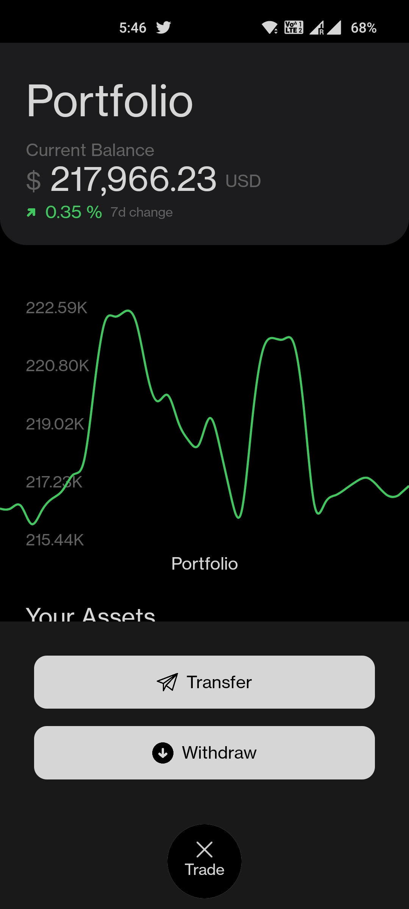
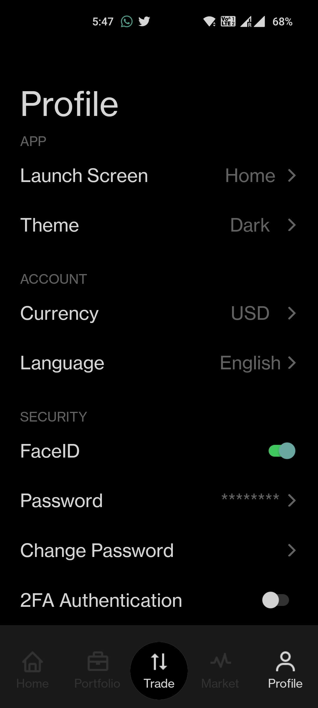
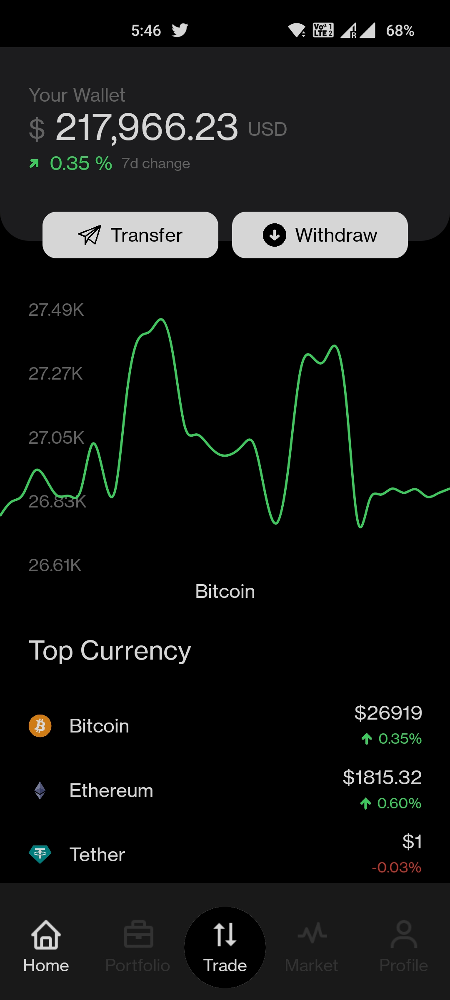
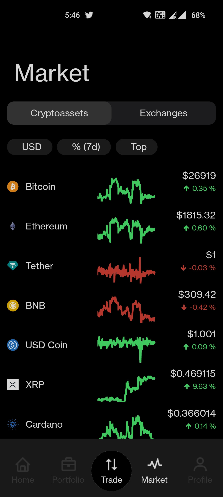
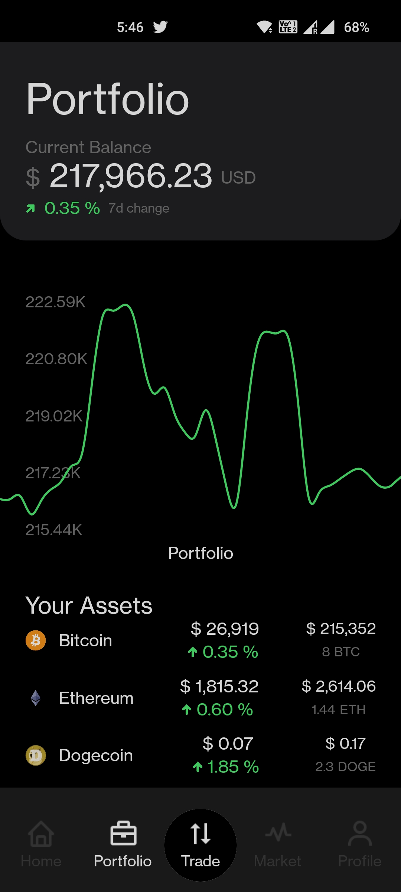

# DigiCoinbase







## Requirements:

```
React Native: 0.71.6
Node: 18.16.0
```

## How to run (in debug mode):

```
npm i
npm run android
npm run start
```

## Get APK:

```
cd android/
./gradlew assembleRelease
```

The APK can be found at android/app/build/outputs/apk/release/

## Running on IOS:

Open the project in XCode and hit build. It will either open in an emulator or physical device.
